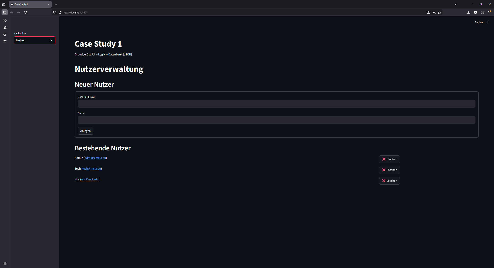
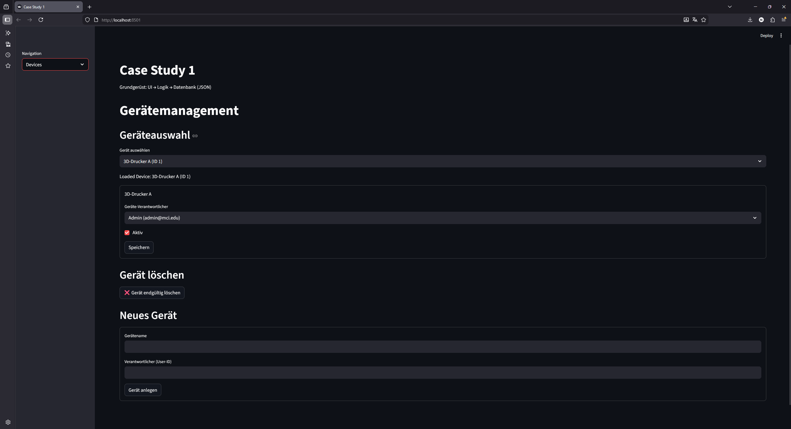
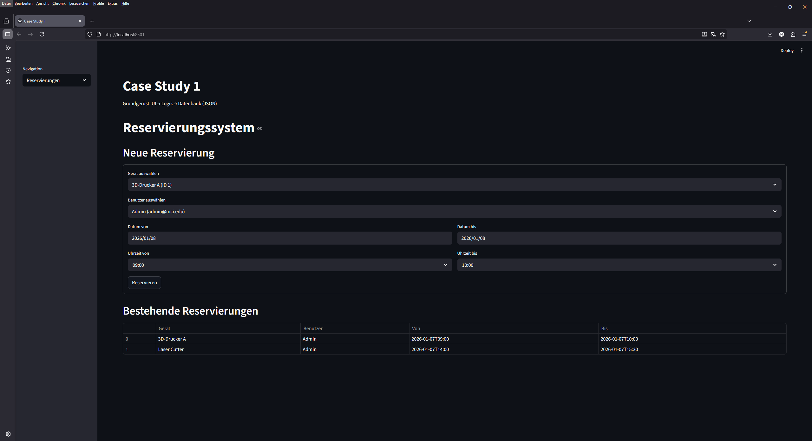
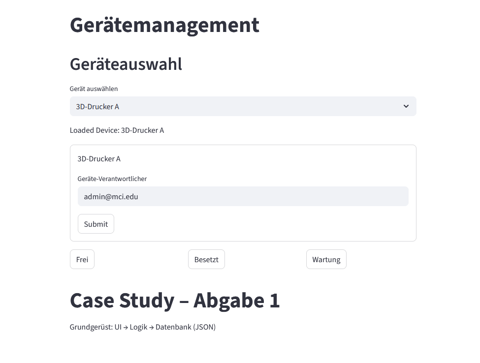

# Case Study

- See instructions in the lecture notes

## Installation and Setup
- Create a virtual environment with `python -m venv .venv`
- Activate the virtual environment with `source .venv/bin/activate`	
- Install packages `pip install -r requirements.txt`

## Usage
- Run the program with `python -m streamlit run src\user_interface.py`
- Updated in the code base take effect immediately as soon the change in the script is saved, no need to restart the server
- The user interface is available at http://localhost:8501
- Problems and print statements are shown in the terminal

## Current Implementation Overview

The application currently provides three main functional modules, accessible via the sidebar navigation.

### User Management

The user management module allows administrators to manage system users.

**Functionality:**
- Create new users by providing:
  - User ID (E-Mail address)
  - User name
- Display a list of existing users
- Delete existing users

All user data is stored persistently in the JSON-based database.

### Device Management

The device management module is used to manage technical devices.

**Functionality:**
- Select an existing device from the database
- Edit device properties:
  - Responsible user
  - Active / inactive state
- Delete existing devices
- Create new devices by specifying:
  - Device name
  - Responsible user (User ID)

All changes are written directly to the database.

---

### Reservation System

The reservation system allows users to reserve devices for specific time periods.

**Functionality:**
- Create new reservations by selecting:
  - Device
  - User
  - Date and time range
- Display all existing reservations in a table view
- Reservations are stored persistently in the database

---

## Testing

- Run the tests with `python -m unittest discover -s tests -p "test_*.py"`
- The tests are located in the `tests` folder

## UI Mockup

